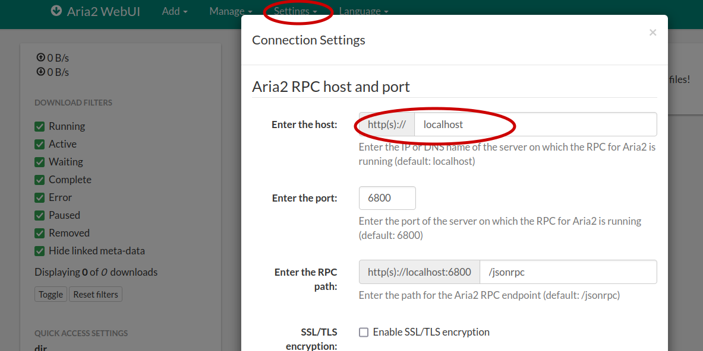
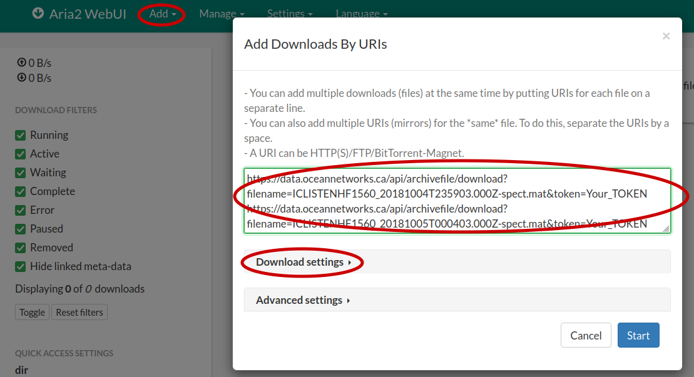

# Download Archived Files

```python
# Get the token from your Oceans 3.0 profile page
from onc import ONC

onc = ONC("YOUR_TOKEN")
```

## [/archivefile/device](https://data.oceannetworks.ca/OpenAPI#get-/archivefile/device)

### Get a list of all archived files available from a specific device for a specific time-range

Return the archived files for a device with _deviceCode_ "**RDIADCP600WH25471**"

```python
params = {
    "deviceCode": "RDIADCP600WH25471",
    "dateFrom": "2019-06-07T00:00:00.000Z",
    "dateTo": "2019-06-08T00:00:00.000Z",
}

onc.getArchivefile(params)

# Longer method name
# onc.getArchivefileByDevice(params)

# Alias method name
# onc.getListByDevice(params)
```

### Get a list of all archived files available from a specific device for a specific time-range with a specific extension

Return the archived files for an ADCP instrument with _deviceCode_ "**RDIADCP600WH25471**" that have _rdi_ as the
extension name.

```python
params = {
    "deviceCode": "RDIADCP600WH25471",
    "extension": "rdi",
    "dateFrom": "2019-06-07T00:00:00.000Z",
    "dateTo": "2019-06-08T00:00:00.000Z",
}

onc.getArchivefile(params)

# Longer method name
# onc.getArchivefileByDevice(params)

# Alias method name
# onc.getListByDevice(params)
```

### Download a file by its filename

```python

onc.downloadArchivefile("ICLISTENHF1560_20181005T000403.000Z-spect.mat", overwrite=True)

# Alias method name
# onc.getFile("ICLISTENHF1560_20181005T000403.000Z-spect.mat", overwrite=True)
```

## [/archivefile/location](https://data.oceannetworks.ca/OpenAPI#get-/archivefile/location)

### Get a list of all archived files available from a specific location and a device category for a specific time-range

Return the archived files for a device with _deviceCategoryCode_ "**HYDROPHONE**" at location Straight of Georgia East (
_locationCode_:"**SEVIP**")

```python
params = {
    "deviceCategoryCode": "HYDROPHONE",
    "locationCode": "SEVIP",
    "dateFrom": "2018-10-05T00:05:00.000Z",
    "dateTo": "2018-10-05T00:06:00.000Z",
}

onc.getArchivefile(params)

# Longer method name
# onc.getArchivefileByLocation(params)

# Alias method name
# onc.getListByLocation(params)
```

### Get a list of all archived files available from a specific location and a device category for a specific time-range with a specific file extension

Return the archived files for a device with _deviceCategoryCode_ "**HYDROPHONE**" at location Straight of Georgia East (
_locationCode_:"**SEVIP**") with file extension "**mat**".

```python
params = {
    "deviceCategoryCode": "HYDROPHONE",
    "locationCode": "SEVIP",
    "extension": "mat",
    "dateFrom": "2018-10-05T00:05:00.000Z",
    "dateTo": "2018-10-05T00:06:00.000Z",
}

onc.getArchivefile(params)

# Longer method name
# onc.getArchivefileByLocation(params)

# Alias method name
# onc.getListByLocation(params)
```

## Download archived files that match the parameters

Download all "mat" files from a hydrophone at Straight of Georgia East (_locationCode_:"**SEVIP**").

```python
params = {
    "deviceCategoryCode": "HYDROPHONE",
    "locationCode": "SEVIP",
    "extension": "mat",
    "dateFrom": "2018-10-05T00:05:00.000Z",
    "dateTo": "2018-10-05T00:06:00.000Z",
}

onc.downloadDirectArchivefile(params)

# Alias method name
# onc.getDirectFiles(params)

```

## Download archived files using a download manager

Return the download URLs from a hydrophone at Straight of Georgia East (_locationCode_:"**SEVIP**").

```python
params = {
    "deviceCategoryCode": "HYDROPHONE",
    "locationCode": "SEVIP",
    "extension": "mat",
    "dateFrom": "2018-10-05T00:00:00.000Z",
    "dateTo": "2018-10-05T00:10:00.000Z",
}

# print is necessary to render the newline character
print(onc.getArchivefileUrls(params, joinedWithNewline=True))
```

After running the code, a list of URLs will be printed.

```
https://data.oceannetworks.ca/api/archivefile/download?filename=ICLISTENHF1560_20181004T235903.000Z-spect.mat&token=Your_TOKEN
https://data.oceannetworks.ca/api/archivefile/download?filename=ICLISTENHF1560_20181005T000403.000Z-spect.mat&token=Your_TOKEN
https://data.oceannetworks.ca/api/archivefile/download?filename=ICLISTENHF1560_20181005T000903.000Z-spect.mat&token=Your_TOKEN
```

At this point, you can open your favorite download manager, paste the URLs, and start the download.
Most modern download managers support batch download, probably from a multi-line text input, the clipboard or a file.

Here is an example of using a popular open source download manager -- aria2.

### webui-aria2

[aria2](https://aria2.github.io/) is a lightweight multi-protocol & multi-source command-line download utility.
[webui-aria2](https://github.com/ziahamza/webui-aria2) is a web interface to interact with aria2.
Refer to the webui-aria2 [README](https://github.com/ziahamza/webui-aria2?tab=readme-ov-file#webui-aria2) file
for more information on how to use the tool.

1. Install aria2 by downloading it from the [release](https://github.com/aria2/aria2/releases)
   (or use your package manager if you are on Linux), extract the zip file,
   and start the server by running

```shell
./aria2c --enable-rpc --rpc-listen-all
```

2. Go to <https://ziahamza.github.io/webui-aria2> (or you can download this repository and open index.html
   from docs folder), change "Enter the host" field to "localhost" in the setting, and save the settings.
   Sometimes you need to also refresh the page.
   

3. Click "Add" -> "By URIs" in the menu. Fill in the URLs and start the download.
   You can also customize the download in the "Download settings" like changing the download directory.
   
